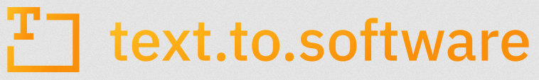
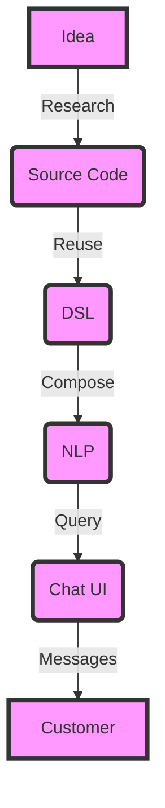

# Software-Centric Solutions - [Text To Software](http://text.to.software)

    Software: Services Driven Approach

## Menu

+ [Human-Centric Solutions - WETWARE.DEV: DigitalTwin](http://www.wetware.dev)
+ [Modular-Centric Solutions - MODWARE.ORG: Dialogware, textware.org](https://www.modware.org)
+ [Agent-Centric Solutions - TeleOperator.org: agent services Gaiann.com, Edi.Chat, do.camera, sub.actor](http://www.TeleOperator.org)
+ [Interface-Centric Solutions - WebStream: Interface streaming for media audio, video, text: VoCo.Cam](http://www.WebStream.dev)
+ [Service-Centric Solutions - SaaSisKing.com - Software Requirements](http://www.SaaSisKing.com)
+ [Software-Centric Solutions - text.to.software - Modular Software](http://text.to.software)
+ [Infrastructure-Centric Solutions - ModDevOps.com: Operations, Domains, DNS, CDN, Dynapsys](http://www.ModDevOps.com)
+ [Security-Centric Solutions - CyberPolygon.org: Incidents Detection, Prevention, Monitoring](http://www.cyberpolygon.org)

+ [SDLC: softreck.dev](http://leadership.run/SDLC)

  
## Our ecosystem:

+ [click.to.software - no code, low code solutions](https://click.to.software/)
+ [dsl.to.software - DSL to Software convertion](https://dsl.to.software/)
+ [srs.to.software - Software Requirements Specification to Software](https://srs.to.software/)
+ [speech.to.software - voice to software with any asystant](https://speech.to.software/)

Dialogware provides a set of formal operators for specializing a description of a general-purpose environment; as operators are applied, the system semi-automatically builds a set of transformation rules used to translate application-specific programs into those of the original general-purpose environment. The output of the tool is an application-specific environment together with a program transformer that provides execution semantics for programs written in that environment.
[A transformational approach to generating application-specific environments](https://dl.acm.org/doi/epdf/10.1145/142868.142917)

  

## Solution: Idea -> Code -> DSL -> NLP -> UI

The process of selling a product, service, or an idea to a user involves a combination of showcasing value, building trust, and demonstrating how it solves a problem or fulfills a need. 
One strategy to effectively sell something is by transitioning from concept to execution, which can be mapped through a pipeline from Source Code to Domain-Specific Language (DSL) to Natural Language Processing (NLP) to User Interface (UI). 
Let's break down this pathway and how it can be utilized to sell something to a user:

### 1. Reqirements

We are starting from Idea to define the requirements we need to make a research.
Selling something to a user requires a multi-layered approach that encompasses solid back-end development, clear and accessible presentation of your product's benefits, interactive and intelligent user engagement, and a compelling user interface. 
By moving effectively from Source Code to DSL, then applying NLP for natural interactions, and finally presenting through an intuitive UI, you can demonstrate the value of your offering in a way that resonates with users, thereby increasing your chances of successful sales.

### 2. Source Code

The journey starts with **Source Code**, which is the foundational code of your product or service. This could involve algorithms, data structures, and functionalities that underpin what you're offering. At this stage, the focus is on developing a robust, efficient, and scalable product. Although the end-user might not interact with the source code directly, the quality of the source code is critical for the overall performance and reliability of the product or service.

Application:
In the context of selling, this step is about making sure that what you're offering is built on a solid foundation. It's about preparing a product that you can confidently stand behind because it works well and delivers on its promises.

### 3. Domain-Specific Language (DSL)

A **DSL** is a computer language specialized to a particular application domain. This is a step towards making the functionalities and capabilities of your product accessible and understandable to those outside of the core development team, including stakeholders or even early adopters in a technical domain.

Application:
Using a DSL allows you to describe and demonstrate the features and benefits of your product in a way that is more accessible to non-technical stakeholders. It can serve as a bridge between the technical and non-technical aspects of your offering, making it easier to communicate value propositions to potential customers in relevant industries.

### 4. Natural Language Processing (NLP)

**NLP** involves applying algorithms to identify and extract the natural language rules such that the unstructured language data is converted into a form that computers can understand. NLP is key in interpreting and generating human-like responses, enabling a more intuitive interaction between users and technology.

Application:
In selling, leveraging NLP technologies can allow you to engage with users in a more natural and human-like manner. For instance, chatbots and virtual assistants can use NLP to answer queries, guide users through your product's features, or troubleshoot problems in real-time. This helps in building a rapport with potential customers, answering their questions instantly, and offering personalized assistance.

### 5. User Interface (UI)

The **UI** is where users interact directly with your product or service. A well-designed UI can greatly enhance the user experience, making it easier for users to explore and utilize the functionalities of your offering. It's the front-end through which the value and capabilities of what you're selling are demonstrated and experienced by the user.

Application:
A compelling UI is essential in selling because it's often the first point of direct contact between your product and potential customers. It needs to be intuitive, engaging, and helpful, providing a positive user experience that showcases the benefits of your offering. Users are more likely to be convinced of the value of your product or service if they can easily see and experience how it works and how it can benefit them.

## Software

Software Centric Solutions
Software = Infra + Sourcecode
Sourcecode Centric Solutions
Development: Sourcode Driven Approach

+ blog: platformengineer.net - DevOps, NetOps  News
+ development department: softreck.dev - CTO - technical side of project

## Development

+ standardization
+ operations
+ cycles

### Development centric

+ Community
+ libraries
+ interfaces
+ API communication
+ SDK integration

  
### Community
Software Integration.

+ DSL - Domain-Specific language.
  
+ apifoundation.com - open source community      

### Functions, libraries

+ apiSQL
+ dslFunc

### Service Market/Provider  [one day run](http://www.onedayrun.com)

Development. Text To Service

+ blog: onepersonsaas.com - One Person SaaS - Automate Yourself
+ SaaS: saasisking.com - SaaS is King - Unattended Sales      
  + oneday.run 
    + dialogware.com - dialog ware - Text To Software
      + dialogSync.com - dialog sync -  
        + webstream.com - web stream - Application Streaming  
          + jloads 

### Software Distribution

for many sofwtare marketplaces for WHMCS, TrueChart, Docker, ...

### Digital Twin Generator - [Twinizer](http://www.twinizer.com)

Based on hitorical connection and Data 
+ App, env Definition - apiMacro.com
+ Data Multi Format Specification - ndof.org 
+ Module Definition - MetaModule.org

---

## EN

Requirements are typically written in natural language. 

However, hardly any automated tools exist that translate natural language texts into software artifacts. 
 
 We propose to adapt recent advances in natural language processing and semantic technologies to generate DSL language which can generate the source code, from natural language input. 
 
It might even be possible to generate executable test cases. 
An intermediate step would be to generate tests from API documentation (which would also be a useful capability in itself). 

Though speculative, a determined, long-term effort in translating text to software could automate and accelerate software development to an unprecedented degree.

## PL

pod koniec przyszłego roku będzie do dyspozycji system operacyjny z konsolą tekstową obsługującą hashtag #texttosoftware , więc każdy w zaciszu domowym będzie sobie testował budowane na podstawie tekstu aplikacje, w czasie rzeczywistym ... bez instalatora, managera, tylko na podstawie kilku zdań opisu każdy z nas będzie miał dostęp do swojego prywatnego marketplace, wychodzimy z systemu, zostawiamy microsoft, google, amazon, ... AI to okienko na wolność dla wolnych ludzi.

### Platforma text to software:

+ [system operacyjny pologOS](http://www.pologos.com)
+ multi-powłoka shell-a - [serwer poloSHELL](http://www.poloshell.com) daje dostęp do:
 + prywatny marketplace - z własnymi aplikacjami texttosoftware
 + repozytoria wolnego - otwartego oprogramowania 

Wersja SaaS platformy umożliwia dostęp do (polo)shell-a przez stronę www (podobnie jak webREPL) - [klient shellUI](http://www.shellui.com)

Zapraszamy do współpracy, poszkujemy chętnych do testowania jedynego na świecie systemu operacyjnego opartego o AI, który generuje aplikacje w czasie rzeczywistym

## Research

+ [All: text to software : Search](https://dl.acm.org/action/doSearch?AllField=text+to+software&expand=all&ConceptID=119584&startPage=0&sortBy=EpubDate_desc)
+ [All: application generator : Search](https://dl.acm.org/action/doSearch?AllField=application+generator&ConceptID=119584&expand=all)
+ 

## Keywords
+ text to service
+ text to software
+ software generator
+ software generation
+ application generator
+ [A transformational approach to generating application-specific environments - Proceedings of the fifth ACM SIGSOFT symposium on Software development environments](https://dl.acm.org/doi/10.1145/142868.142917)
+ [A pattern-based application generator for building simulation - Proceedings of the 6th European SOFTWARE ENGINEERING conference held jointly with the 5th ACM SIGSOFT international symposium on Foundations of software engineering](https://dl.acm.org/doi/10.1145/267895.267927)

## kontakt:

+ [Tom Sapletta, Architekt platformy TextToSoftware](https://www.linkedin.com/in/tom-sapletta-com)

---

+ [edit](https://github.com/text-to-software/text.to.software/edit/main/README.md)

